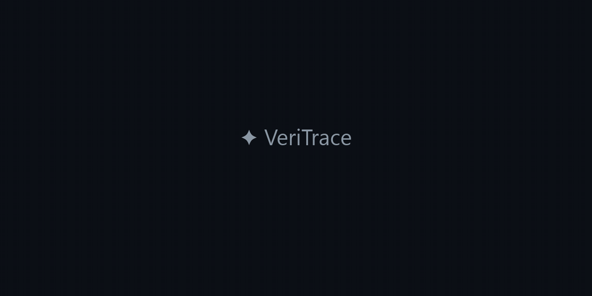
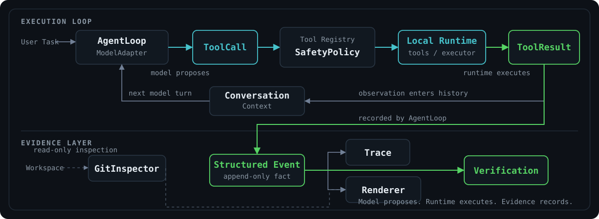

<div align="center">

# ✦ VeriTrace

### A controllable, observable, and verifiable local coding agent

**Model claims are not execution facts. Verification uses evidence.**

A lightweight coding agent built from scratch with native tool calling,
controlled local execution, structured tracing, and evidence-based verification.

<p>
  <a href="https://www.python.org/"></a>
  <a href="#how-veritrace-works"></a>
  <a href="#why-veritrace"></a>
  <a href="#evaluation"></a>
</p>

[Demo](#demo) · [Why VeriTrace?](#why-veritrace) · [How It Works](#how-veritrace-works) · [Features](#features) · [Quick Start](#quick-start) · [Evaluation](#evaluation) · [Limitations](#safety-and-limitations)



</div>

## Demo

The animation above is a condensed visualization of a reproducible
regression-fixing run, not a fabricated raw terminal recording. VeriTrace adds a
focused regression test, observes the failure as execution feedback, applies the
smallest production fix, and verifies the full test suite.

The maintained scenarios are defined in
[`demo/scenarios.py`](demo/scenarios.py). For a complete reproducible walkthrough,
see [docs/DEMO.md](docs/DEMO.md):

```powershell
python demo/create_demo_workspace.py --scenario bugfix --output "$env:TEMP\veritrace-bugfix" --force
```

## Why VeriTrace?

| Control | Observe | Verify |
|---|---|---|
| Workspace boundary | Structured Events | Evidence-based Verification |
| Sensitive-file guard | Append-only JSONL trace | Real command results |
| Deterministic command policy | Metrics / Rich CLI | Final test state |
| Timeout / process cleanup | Human/model projections | Git change evidence |

### Control

The model proposes normalized `ToolCall` objects; the local runtime validates and
executes them. Workspace path enforcement, sensitive-file filtering, command
timeouts, process-tree cleanup, and policy checks reduce common risks.
**SafetyPolicy is a deterministic best-effort guard, not an OS sandbox.**

### Observe

Every tool returns a normalized `ToolResult`, and the loop emits structured
`Event` facts. Append-only JSONL tracing, metrics, and the Rich renderer are
projections of those facts rather than hidden orchestration inside the model.

### Verify

The model may claim completion, but VeriTrace evaluates verification from real
local execution evidence rather than trusting that claim. Test-like command
results, exit codes, timeouts, and final workspace changes support the displayed
status; they do not constitute a proof of semantic correctness.

## How VeriTrace Works

<div align="center">
  
</div>

- `ToolResult` — normalized execution observation.
- `Event` — append-only structured execution fact.
- History — projection for the model.
- Renderer — projection for the human.

This separation lets presentation evolve without changing the agent's control
logic. Provider-hosted file systems and provider-hosted code execution are not
used. See [docs/ARCHITECTURE.md](docs/ARCHITECTURE.md) for the detailed design.

## Features

### Agent Core

- Native OpenAI-compatible tool calling behind a provider-isolated adapter.
- Explicit `AgentLoop` with conversation/tool-result pairing and multiple calls
  per model response.
- Errors returned as observations, maximum-step termination, and lightweight
  repeated-action detection.

### Local Tools

- Workspace-scoped `list_files`, `search_code`, and `read_file`.
- `edit_file` with exact, unique SEARCH/REPLACE semantics.
- `write_file` and `run_command` with normalized results.

### Execution Safety

- Resolved workspace boundary and sensitive-file protection.
- Deterministic best-effort command policy before execution.
- Timeout, process-tree termination, and bounded stdout/stderr output.

### Observability and Verification

- Append-only JSONL trace with defensive redaction and bounded previews.
- Metrics and terminal-native Rich rendering with adaptive edit previews.
- Read-only Git status/diff presentation and deterministic verification summary.

## Quick Start

Clone the repository:

```bash
git clone https://github.com/Darwin3961/veritrace.git
cd veritrace
```

Windows PowerShell:

```powershell
python -m venv .venv
.\.venv\Scripts\Activate.ps1
pip install -r requirements.txt

$env:DEEPSEEK_API_KEY = "<your-key>"
$env:MODEL_BASE_URL = "https://api.deepseek.com"
$env:MODEL_NAME = "deepseek-v4-flash"

# Interactive
python main.py --workspace <path>

# One-shot
python main.py --workspace <path> "Fix the failing tests and verify the result."
```

POSIX shell:

```bash
python -m venv .venv
source .venv/bin/activate
pip install -r requirements.txt

export DEEPSEEK_API_KEY="<your-key>"
export MODEL_BASE_URL="https://api.deepseek.com"
export MODEL_NAME="deepseek-v4-flash"

python main.py --workspace ./demo-project \
  "Fix the failing tests, make the smallest correct change, and verify the result."
```

In Rich mode, omitting the task starts the interactive CLI. It accepts repeated
independent tasks and provides slash-command completion for `/help`, `/status`,
`/trace`, `/verify`, `/clear`, and `/exit`. Plain mode remains a single-run,
automation-friendly interface.

Set environment variables in your shell. VeriTrace does not automatically load
`.env` files. `MODEL_BASE_URL` and `MODEL_NAME` are optional overrides;
`DEEPSEEK_API_KEY` is required for live model calls. Do not commit credentials.

The current CLI entry point is `python main.py`; this repository does not publish
a `veritrace` console script. Available options are:

- `--workspace`
- `--max-steps`
- `--trace-dir`
- `--no-trace`
- `--max-repeated-actions`
- `--plain`
- `--no-diff`

## Evaluation

The evaluation runner creates an isolated workspace for each scenario, invokes
the real agent core, and then executes a separate verification command. Success
therefore depends on independent local verification rather than the model's final
text.

| Evaluation | Result |
|---|---:|
| Automated tests | 376 passed, 1 skipped |
| Reproducible scenarios | 3 (`bugfix`, `implement`, `multi_file`) |
| Recorded live model runs | 12 / 12 passed |

The scenario count comes from [`demo/scenarios.py`](demo/scenarios.py), the
automated-test count is verified by the repository test suite, and the live-run
row records repeated model-backed executions of the maintained scenarios. This is
a small internal reproducible evaluation, not a general coding-agent benchmark.

```powershell
python eval/run_eval.py --scenario bugfix
python eval/run_eval.py --all --output-json eval/results/latest.json
```

Live evaluation requires `DEEPSEEK_API_KEY`; JSON output contains normalized
result and metric fields, not conversation history or credentials.

## Safety and Limitations

- SafetyPolicy is not a sandbox. Its deterministic checks are a best-effort risk
  reduction layer, not OS or network isolation.
- `run_command` executes on the host with its working directory fixed to the
  configured workspace; shell filtering cannot fully isolate arbitrary commands.
- Test-command detection is heuristic.
- Verification means observed commands and results support the displayed status;
  it is not a proof of semantic correctness.
- Conversation history is linear and currently has no context compaction.
- The design targets small and medium local coding tasks, not repository-scale
  semantic context for very large codebases.
- There is no persistent interactive shell session.
- Task success still depends on model behavior and the local environment.
- Advanced orchestration features such as multi-agent execution, RAG, MCP
  integration, and long-term memory are intentionally out of scope.

## Project Structure

```text
coding_agent/
├── agent.py          Agent loop, termination, and tool dispatch
├── model.py          OpenAI-compatible provider adapter
├── context.py        Conversation and tool-result history
├── registry.py       Tool schemas, policy check, and dispatch
├── tools.py          Workspace-scoped file operations
├── executor.py       Local command execution and timeout handling
├── policy.py         Deterministic best-effort safety checks
├── session.py        Append-only trace and metrics
├── verification.py   Evidence-based verification summary
├── renderer.py       Rich event projection for humans
└── git_utils.py      Read-only workspace status and diff inspection

demo/                 Deterministic scenario definitions and generator
eval/                 Live evaluation runner with independent verification
docs/                 Architecture, demo, and presentation guides
scripts/              Release and submission checks
tests/                Unit and integration tests
main.py               Command-line entry point
```

## Documentation

- [Architecture](docs/ARCHITECTURE.md) — lifecycle, contracts, and design tradeoffs.
- [Reproducible Demo](docs/DEMO.md) — end-to-end Windows PowerShell walkthrough.
